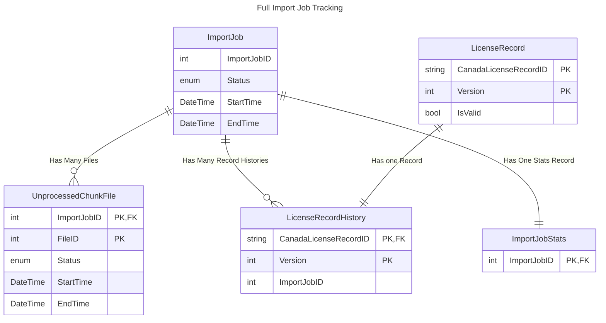

```mermaid
---
title: Full Import Job Tracking
---
erDiagram
    ImportJob {
        int ImportJobID
        enum Status
        DateTime StartTime
        DateTime EndTime
    }

    UnprocessedChunkFile {
        int ImportJobID PK, FK
        int FileID PK
        enum Status
        DateTime StartTime
        DateTime EndTime
    }

    ImportJobStats {
        int ImportJobID PK, FK
    }


    LicenseRecord {
        string CanadaLicenseRecordID PK
        int Version PK
        bool IsValid
    }

    LicenseRecordHistory {
        string CanadaLicenseRecordID PK, FK
        int Version PK
        int ImportJobID
    }

    ImportJob ||--o{ UnprocessedChunkFile : "Has Many Files"
    ImportJob ||--o{ LicenseRecordHistory : "Has Many Record Histories"
    ImportJob ||--|| ImportJobStats : "Has One Stats Record"
    LicenseRecord ||--|| LicenseRecordHistory : "Has one Record"
```