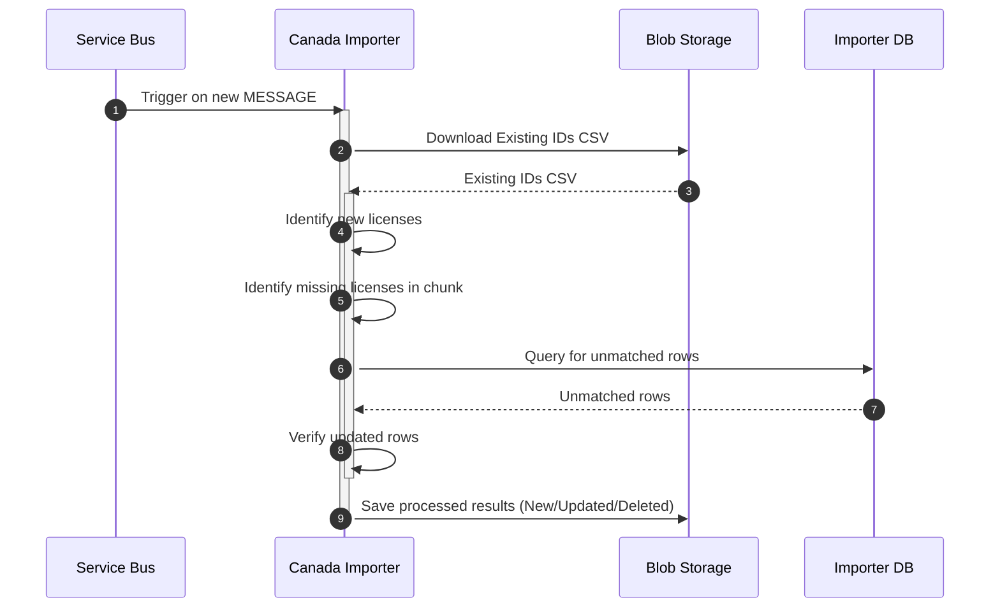

```mermaid
sequenceDiagram
    autonumber
    participant SB as Service Bus
    participant Importer as Canada Importer
    participant Blob as Blob Storage
    participant DB as Importer DB

    SB ->> Importer: Trigger on new MESSAGE
    activate Importer

        Importer ->> Blob: Download Existing IDs CSV
        Blob -->> Importer: Existing IDs CSV

        activate Importer
            Importer ->> Importer: Identify new licenses
            Importer ->> Importer: Identify missing licenses in chunk
            Importer ->> DB: Query for unmatched rows
            DB -->> Importer: Unmatched rows
            Importer ->> Importer: Verify updated rows
        deactivate Importer

        Importer ->> Blob: Save processed results (New/Updated/Deleted)
    deactivate Importer
```