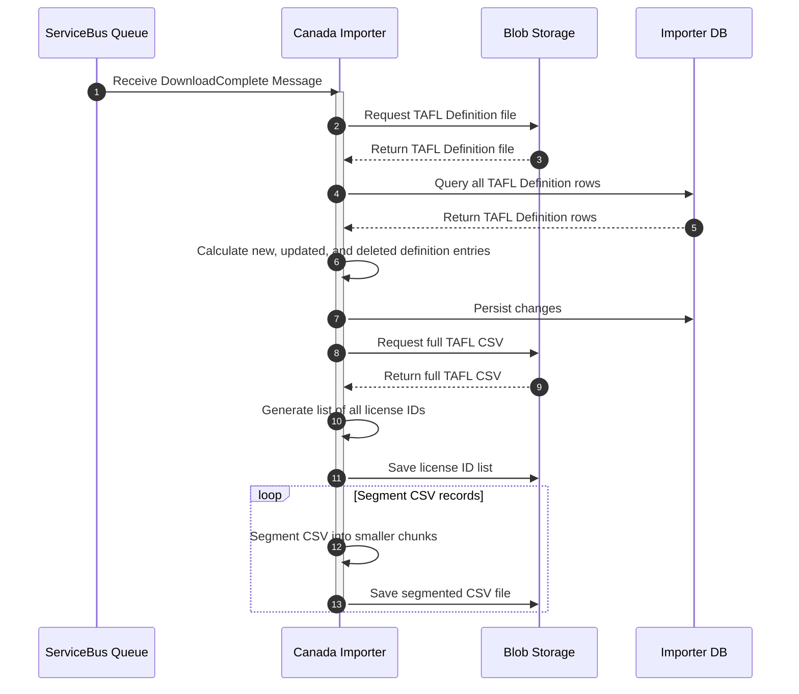

```mermaid
sequenceDiagram
    autonumber
    participant SB as ServiceBus Queue
    participant Importer as Canada Importer
    participant Storage as Blob Storage
    participant DB as Importer DB

    SB ->> Importer: Receive DownloadComplete Message
    activate Importer

        Importer ->> Storage: Request TAFL Definition file
        Storage -->> Importer: Return TAFL Definition file

        Importer ->> DB: Query all TAFL Definition rows
        DB -->> Importer: Return TAFL Definition rows

        Importer ->> Importer: Calculate new, updated, and deleted definition entries
        Importer ->> DB: Persist changes

        Importer ->> Storage: Request full TAFL CSV
        Storage -->> Importer: Return full TAFL CSV

        Importer ->> Importer: Generate list of all license IDs
        Importer ->> Storage: Save license ID list

        loop Segment CSV records
            Importer ->> Importer: Segment CSV into smaller chunks
            Importer ->> Storage: Save segmented CSV file
        end

    deactivate Importer
```