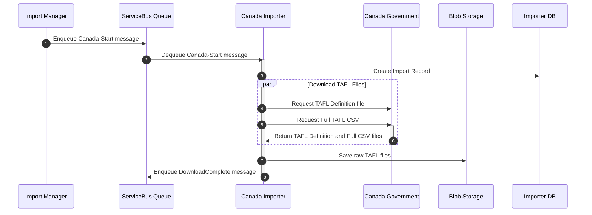

```mermaid
sequenceDiagram
    autonumber
    participant ImportManager as Import Manager
    participant Queue as ServiceBus Queue
    participant Importer as Canada Importer
    participant Gov as Canada Government
    participant Storage as Blob Storage
    participant DB as Importer DB

    ImportManager ->> Queue: Enqueue Canada-Start message
    Queue ->> Importer: Dequeue Canada-Start message
    activate Importer

    Importer ->> DB: Create Import Record

    par Download TAFL Files
        Importer ->> Gov: Request TAFL Definition file
        Importer ->> Gov: Request Full TAFL CSV
        activate Gov
        Gov -->> Importer: Return TAFL Definition and Full CSV files
        deactivate Gov
    end

    Importer ->> Storage: Save raw TAFL files
    Importer -->> Queue: Enqueue DownloadComplete message
    deactivate Importer
```